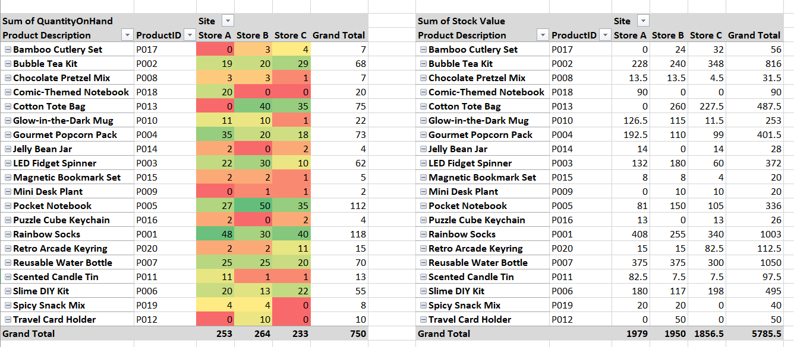

# Inventory Management System (Excel)

## Overview
This project demonstrates a dynamic inventory management system built in Microsoft Excel. It calculates real-time stock levels based on transaction data and identifies products requiring replenishment.

## Key Features
- Dynamic stock calculation using SUMIFS
- Site-level inventory tracking
- Reorder threshold monitoring
- Pivot-based summary view for review

## Tools Used
- Microsoft Excel
- Structured Tables
- SUMIFS
- Pivot Tables

## Preview

